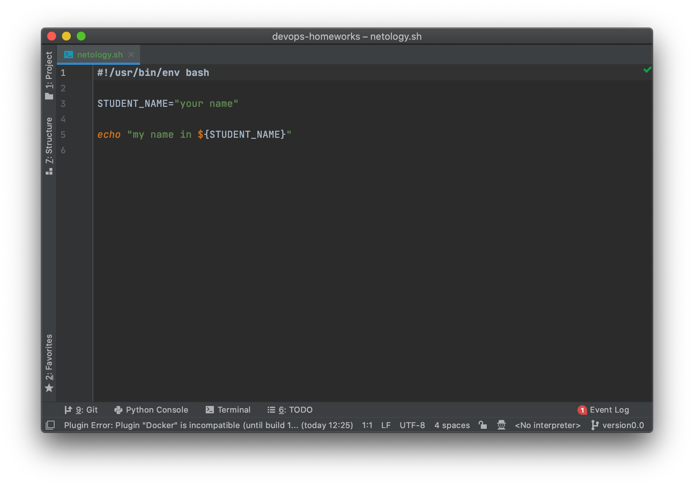
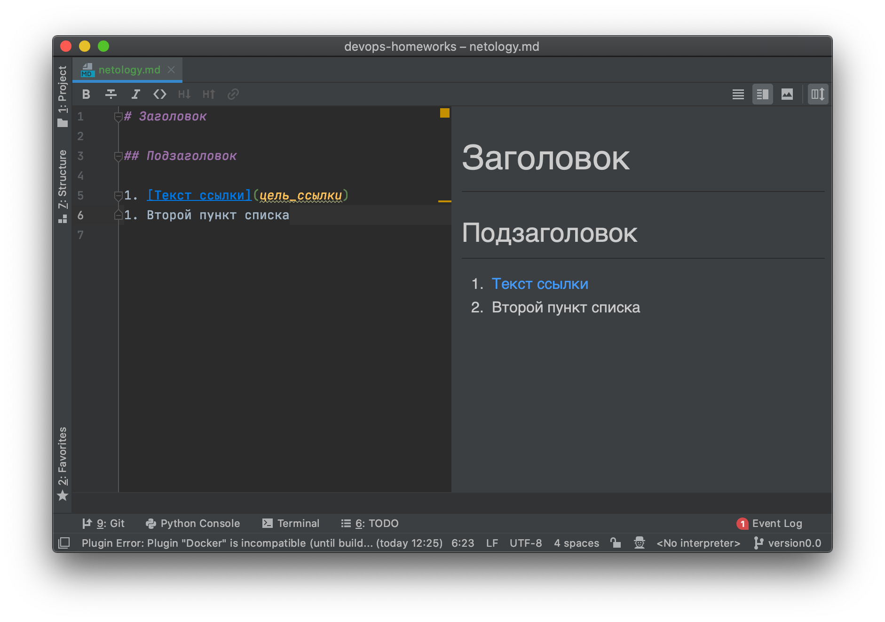

## Как сдавать задания

Обязательными к выполнению являются задачи без указания звездочки. Их выполнение необходимо для получения зачета и диплома о профессиональной переподготовке.

Задачи со звездочкой (*) являются дополнительными задачами и/или задачами повышенной сложности. Они не являются обязательными к выполнению, но помогут вам глубже понять тему.

Домашнее задание выполните в файле readme.md в github репозитории. В личном кабинете отправьте на проверку ссылку на .md-файл в вашем репозитории.

Также вы можете выполнить задание в [Google Docs](https://docs.google.com/document/u/0/?tgif=d) и отправить в личном кабинете на проверку ссылку на ваш документ.
Название файла Google Docs должно содержать номер лекции и фамилию студента. Пример названия: "1.1. Введение в DevOps — Сусанна Алиева".

Если необходимо прикрепить дополнительные ссылки, просто добавьте их в свой Google Docs.

Перед тем как выслать ссылку, убедитесь, что ее содержимое не является приватным (открыто на комментирование всем, у кого есть ссылка), иначе преподаватель не сможет проверить работу. Чтобы это проверить, откройте ссылку в браузере в режиме инкогнито.

[Как предоставить доступ к файлам и папкам на Google Диске](https://support.google.com/docs/answer/2494822?hl=ru&co=GENIE.Platform%3DDesktop)

[Как запустить chrome в режиме инкогнито ](https://support.google.com/chrome/answer/95464?co=GENIE.Platform%3DDesktop&hl=ru)

[Как запустить  Safari в режиме инкогнито ](https://support.apple.com/ru-ru/guide/safari/ibrw1069/mac)

Любые вопросы по решению задач задавайте в чате Slack.

---

# Домашнее задание к занятию «1.1. Введение в DevOps»

### Цель задания

В результате выполнения задания вы:

1. Установить PyCharm Community Edition: https://www.jetbrains.com/ru-ru/pycharm/download/ - это бесплатная версия IDE. 
Если у вас уже установлен любой другой продукт от JetBrains,то можно использовать его. 
1. Установить плагины:
    - Terraform,
    - MarkDown,
    - Yaml/Ansible Support,
    - Jsonnet.
1. Склонировать текущий репозиторий или просто создать файлы для проверки плагинов:
    - [netology.tf](netology.tf) – terraform,
    - [netology.sh](netology.sh) – bash,
    - [netology.md](netology.md) – markdown, 
    - [netology.yaml](netology.yaml) – yaml,
    - [netology.jsonnet](netology.jsonnet) – jsonnet.
1. Убедитесь, что работает подсветка синтаксиса, файлы должны выглядеть вот так:
    - Terraform: 
    - Bash: 
    - Markdown: 
    - Yaml: 
    - Jsonnet: 
1. Добавьте свое имя в каждый файл, сделайте снимок экрана и загрузите его на любой сервис обмена картинками.
1. Ссылки на картинки укажите в личном кабинете как решение домашнего задания. 

### Инструкция к заданию

Домашнее задание выполните в файле README.md в своём репозитории на GitHub или в Google Doc.

1. Сделайте копию [«Шаблона для домашнего задания»](https://docs.google.com/document/d/1youKpKm_JrC0UzDyUslIZW2E2bIv5OVlm_TQDvH5Pvs/edit) себе на Google Диск.
2. В названии файла введите корректное название лекции, ваши фамилию и имя.
3. Зайдите в «Настройки доступа» и откройте доступ «Просматривать могут все в интернете, у кого есть ссылка».
Инструкция «Как предоставить доступ к файлам и папкам на Google Диске» доступна [по ссылке](https://support.google.com/docs/answer/2494822?hl=ru&co=GENIE.Platform%3DDesktop).
4. Выполните домашнее задание, запишите ответы и добавьте необходимые скриншоты в свой Google Doc.
5. Для проверки домашнего задания отправьте ссылку на ваш документ в личном кабинете.
6. Любые вопросы по решению задач задавайте в чате учебной группы.

### Дополнительные материалы для выполнения задания

1.  [PyCharm Community Edition](https://www.jetbrains.com/ru-ru/pycharm/download/).
2.  [Visual Studio Code](https://code.visualstudio.com/Download).   
 
 
----     
     
## Задание 1. Подготовка рабочей среды

Вы пришли на новое место работы или приобрели новый компьютер. Сначала надо настроить окружение для дальнейшей работы. 

**Что нужно сделать**

**Шаг 1.** Установить [PyCharm Community Edition](https://www.jetbrains.com/ru-ru/pycharm/download/). Это бесплатная версия IDE.   В качестве альтернативы можно установить [Visual Studio Code](https://code.visualstudio.com/Download) и дальнейшие шаги проделать в нём. Так вы сможете выбрать более удобный инструмент для себя.

Дальше для примера будут даны скриншоты из PyCharm.

**Шаг 2.** Установить плагины:

* Terraform.
* MarkDown.
* Yaml или Ansible Support.
* Jsonnet.
   
**Шаг 3.** Склонировать текущий репозиторий (команда `git clone`) или просто создать файлы для проверки плагинов:

* [netology.tf](netology.tf) — Terraform;
* [netology.sh](netology.sh) — Bash;
* [netology.md](netology.md) — Markdown; 
* [netology.yaml](netology.yaml) — YAML;
* [netology.jsonnet](netology.jsonnet) — Jsonnet.

**Шаг 4**. Убедитесь, что работает подсветка синтаксиса. Файлы должны выглядеть так:

* Terraform: 
* Bash: 
* Markdown: 
* Yaml: 
* Jsonnet: 

*В качестве выполненного задания загрузите скриншоты установленной IDE с плагинами в файле README.md собственного репозитория в GitHub или в Google Doc.*

----

## Задание 2. Описание жизненного цикла задачи (разработки нового функционала)

Чтобы лучше понимать предназначение инструментов, с которыми вам предстоит работать, составим схему жизненного цикла задачи в идеальном для вас случае.

### Описание истории

Представьте, что вы работаете в стартапе, который запустил интернет-магазин. Он достаточно успешно развивался, и пришло время налаживать процессы: у вас стало больше конечных клиентов, менеджеров и разработчиков.

Сейчас от клиентов вам приходят задачи, связанные с разработкой нового функционала. Задач много, и все они требуют выкладки на тестовые среды, одобрения тестировщика, проверки менеджером перед показом клиенту. В некоторых случаях вам будет необходим откат изменений. 

### Решение задачи

Вам нужно описать процесс решения задачи в соответствии с жизненным циклом разработки программного обеспечения. Использование конкретного метода разработки необязательно. 

Для решения главное — прописать по пунктам шаги решения задачи (релизации в конечный результат) с участием менеджера, разработчика (или команды разработчиков), тестировщика (или команды тестировщиков) и себя как DevOps-инженера. 

*Ответ пришлите в свободной форме.*

-----

### Правила приёма домашнего задания

В личном кабинете отправлены ссылка или файл:

- ссылка на документ (Google Doc) с выполненным заданием. В документе настроены права доступа «Просматривать могут все в интернете, у кого есть ссылка»;
- или файл .md в вашем репозитории на GitHub. 

### Критерии оценки

Зачёт:

* выполнены все задания;
* ответы даны в развёрнутой форме;
* приложены соответствующие скриншоты и файлы проекта;
* в выполненных заданиях нет противоречий и нарушения логики.

На доработку:

* задание выполнено частично или не выполнено вообще;
* в логике выполнения заданий есть противоречия и существенные недостатки. 
 
