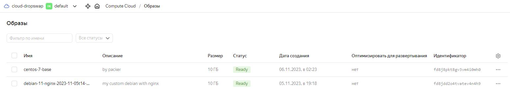
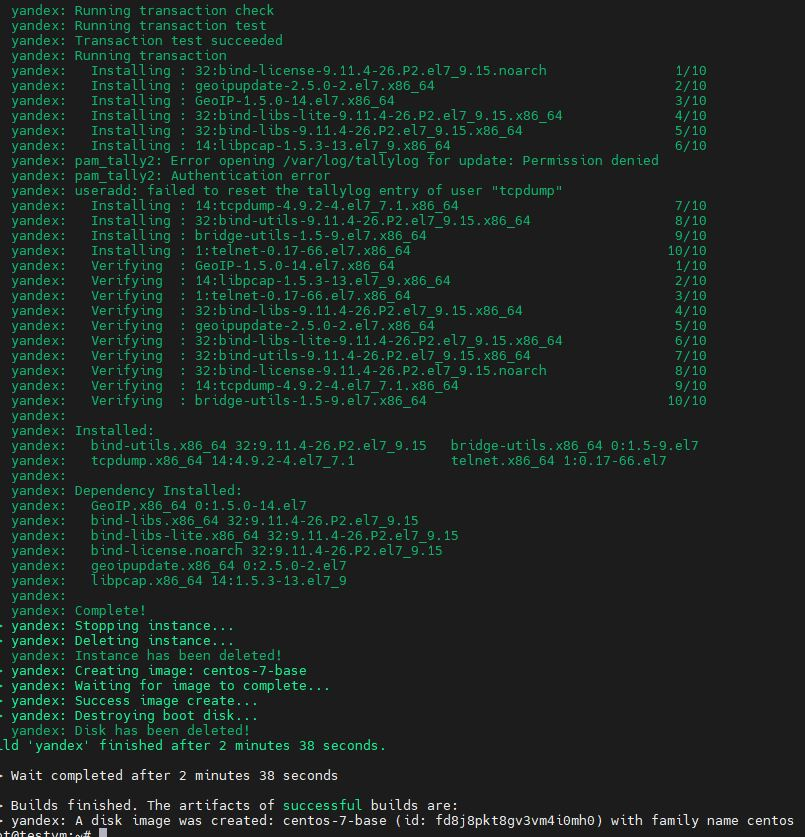
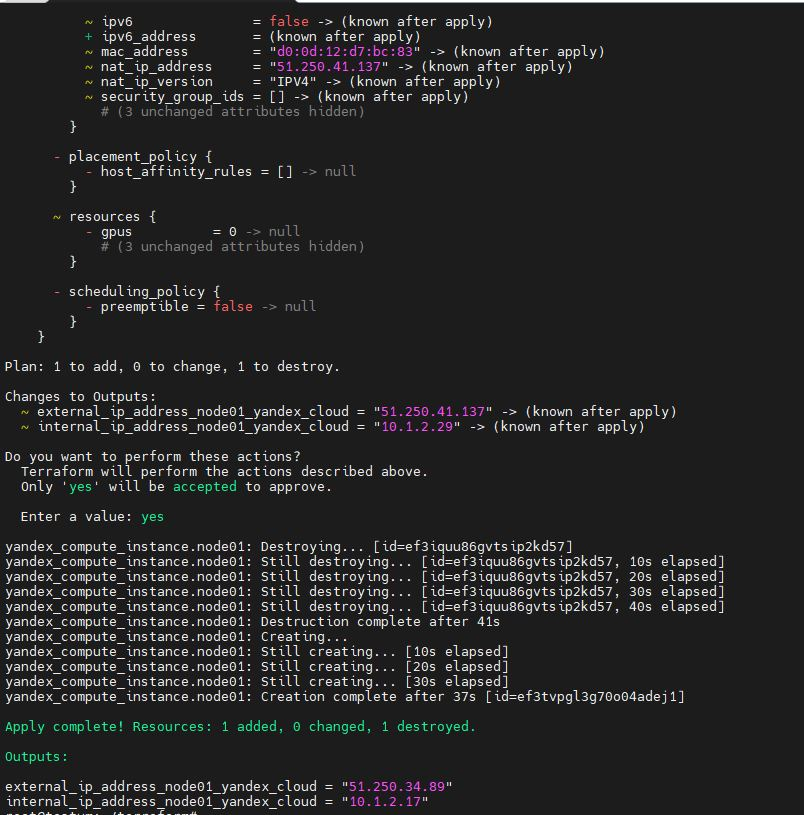
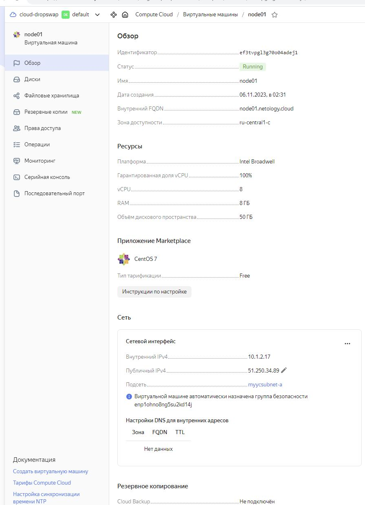
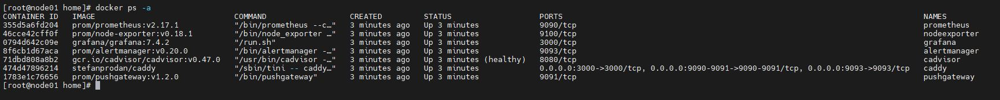
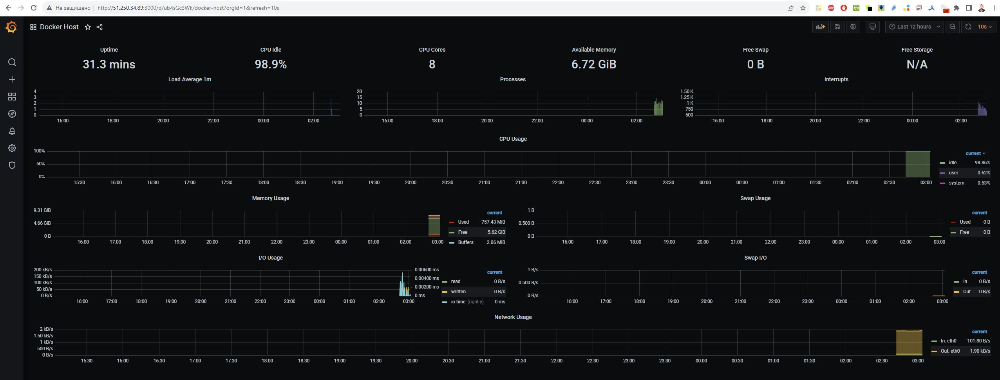
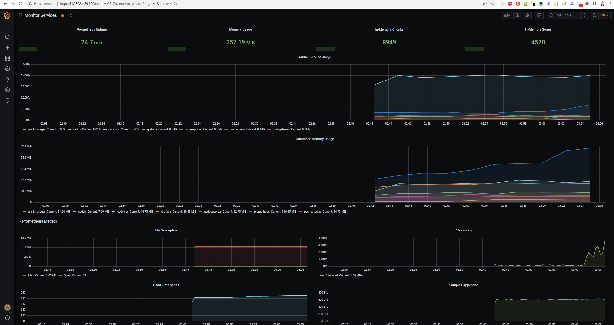
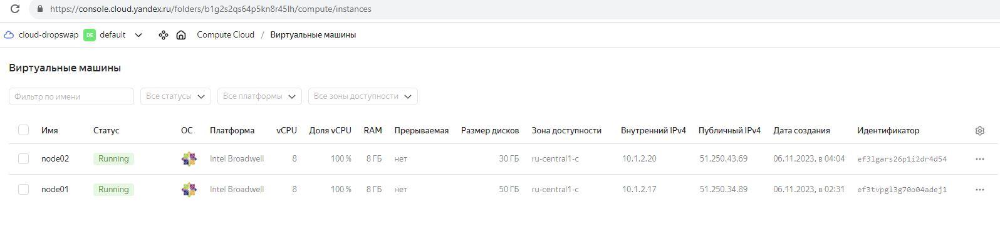
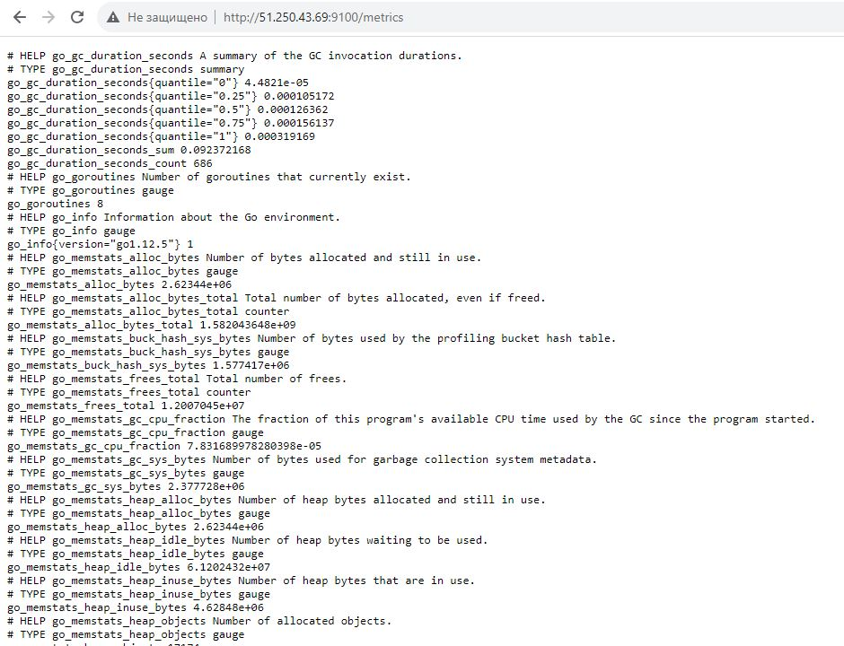

# Домашнее задание к занятию 4. «Оркестрация группой Docker-контейнеров на примере Docker Compose»

## Задача 1


Создайте собственный образ любой операционной системы (например, debian-11) с помощью Packer версии 1.7.0 .



## Задача 2

**2.1.** Создайте вашу первую виртуальную машину в YandexCloud с помощью web-интерфейса YandexCloud.        

**2.2.*** **(Необязательное задание)**      
Создайте вашу первую виртуальную машину в YandexCloud с помощью Terraform (вместо использования веб-интерфейса YandexCloud).




## Задача 3

С помощью Ansible и Docker Compose разверните на виртуальной машине из предыдущего задания систему мониторинга на основе Prometheus/Grafana.

Чтобы получить зачёт, вам нужно предоставить вывод команды "docker ps" .



## Задача 4

1. Откройте веб-браузер, зайдите на страницу http://<внешний_ip_адрес_вашей_ВМ>:3000.




## Задача 5 (*)

Создайте вторую ВМ и подключите её к мониторингу, развёрнутому на первом сервере.

```
Запустил 2 ноду, метрики отдаются, но в Grafana не победил...
```



