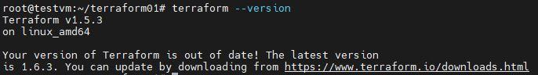

# Домашнее задание к занятию «Введение в Terraform»

### Цели задания

1. Установить и настроить Terrafrom.
2. Научиться использовать готовый код.

------

### Чек-лист готовности к домашнему заданию

1. Скачайте и установите **Terraform** версии =1.5.Х (версия 1.6 может вызывать проблемы с Яндекс провайдером) . Приложите скриншот вывода команды

```terraform --version```.



2. Скачайте на свой ПК этот git-репозиторий. Исходный код для выполнения задания расположен в директории **01/src**.

``` + ```

3. Убедитесь, что в вашей ОС установлен docker.

``` + ```

4. Зарегистрируйте аккаунт на сайте https://hub.docker.com/, выполните команду docker login и введите логин, пароль.

``` + ```

### Задание 1

1. Перейдите в каталог [**src**](https://github.com/netology-code/ter-homeworks/tree/main/01/src). Скачайте все необходимые зависимости, использованные в проекте. 

``` + ```

2. Изучите файл **.gitignore**. В каком terraform-файле, согласно этому .gitignore, допустимо сохранить личную, секретную информацию?

``` personal.auto.tfvars ``` 

3. Выполните код проекта. Найдите  в state-файле секретное содержимое созданного ресурса **random_password**, пришлите в качестве ответа конкретный ключ и его значение.


4. Раскомментируйте блок кода, примерно расположенный на строчках 29–42 файла **main.tf**.
Выполните команду ```terraform validate```. Объясните, в чём заключаются намеренно допущенные ошибки. Исправьте их.

```
Переведу текст: 
1 ошибка - Отсутствует имя ресурса >>>> block label может быть либо 0, либо 2. (Отсутствовал 2)
2 ошибка - Недопустимое имя ресурса (1nginx)
И внизу подсказка - **Имя должно начинаться с буквы или символа подчеркивания** и может содержать только буквы, цифры, знаки подчеркивания и тире.
 (ответ подсветил)
3 ошибка - Ссылка на незадекларированный ресурс {random_password.random_string_FAKE.resulT} 
Верный ...string.result
```

5. Выполните код. В качестве ответа приложите: исправленный фрагмент кода и вывод команды ```docker ps```.


6. Замените имя docker-контейнера в блоке кода на ```hello_world```. Не перепутайте имя контейнера и имя образа. Мы всё ещё продолжаем использовать name = "nginx:latest". Выполните команду ```terraform apply -auto-approve```.
Объясните своими словами, в чём может быть опасность применения ключа  ```-auto-approve```. В качестве ответа дополнительно приложите вывод команды ```docker ps```.

```
Запустил без -auto-approve, docker выругался, что существует контейнер с таким-то именем, вы его либо удалите, либо переименуйте.
С -auto-approve, в тихом режиме, terraform удалил работающий контейнер и развернул новый под тем же именем.
Опасность -auto-approve очень велика. Может  быть удалено/заменено все что угодно, без ведома ответственного за инфраструктуру.
```
8. Уничтожьте созданные ресурсы с помощью **terraform**. Убедитесь, что все ресурсы удалены. Приложите содержимое файла **terraform.tfstate**. 


9. Объясните, почему при этом не был удалён docker-образ **nginx:latest**. Ответ **обязательно** подкрепите строчкой из документации [**terraform провайдера docker**](https://docs.comcloud.xyz/providers/kreuzwerker/docker/latest/docs).  (ищите в классификаторе resource docker_image )

```
https://docs.comcloud.xyz/providers/kreuzwerker/docker/latest/docs/resources/image#keep_locally
```
Аргумент keep_locally объявлен true, т.е. хранить локально (или сохранить)
Установим false - то image удаляется из локального хранилища.
------

## Дополнительное задание (со звёздочкой*)

**Настоятельно рекомендуем выполнять все задания со звёздочкой.** Они помогут глубже разобраться в материале.   
Задания со звёздочкой дополнительные, не обязательные к выполнению и никак не повлияют на получение вами зачёта по этому домашнему заданию. 

### Задание 2*

1. Изучите в документации provider [**Virtualbox**](https://docs.comcloud.xyz/providers/shekeriev/virtualbox/latest/docs) от 
shekeriev.
2. Создайте с его помощью любую виртуальную машину. Чтобы не использовать VPN, советуем выбрать любой образ с расположением в GitHub из [**списка**](https://www.vagrantbox.es/).

В качестве ответа приложите plan для создаваемого ресурса и скриншот созданного в VB ресурса. 


------

