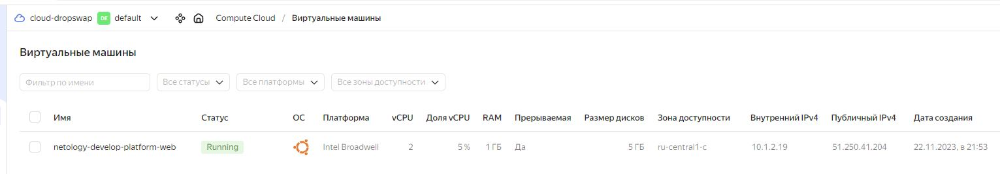
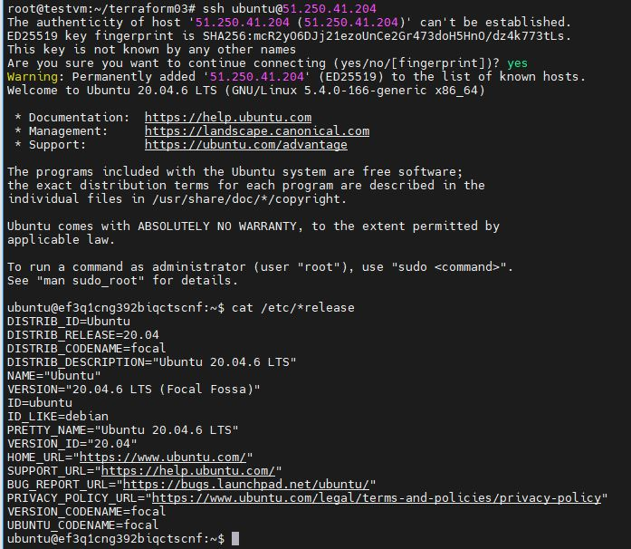
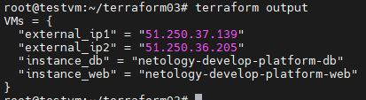
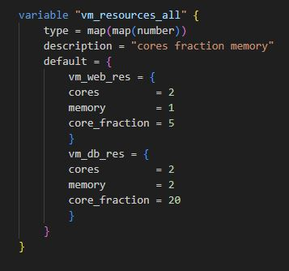
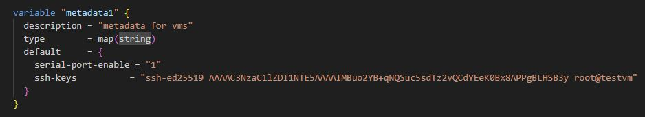

# Домашнее задание к занятию «Основы Terraform. Yandex Cloud»

### Задание 0

1. Ознакомьтесь с [документацией к security-groups в Yandex Cloud](https://cloud.yandex.ru/docs/vpc/concepts/security-groups?from=int-console-help-center-or-nav).
2. Запросите preview-доступ к этому функционалу в личном кабинете Yandex Cloud. Обычно его выдают в течение 24-х часов.
https://console.cloud.yandex.ru/folders/<ваш cloud_id>/vpc/security-groups.   
Этот функционал понадобится к следующей лекции. 

------
### Внимание!! Обязательно предоставляем на проверку получившийся код в виде ссылки на ваш github-репозиторий!
------

### Задание 1
В качестве ответа всегда полностью прикладывайте ваш terraform-код в git.  Убедитесь что ваша версия **Terraform** =1.5.Х (версия 1.6.Х может вызывать проблемы с Яндекс провайдером) 

1. Изучите проект. В файле variables.tf объявлены переменные для Yandex provider.
``` + ```

2. Переименуйте файл personal.auto.tfvars_example в personal.auto.tfvars. Заполните переменные: идентификаторы облака, токен доступа. Благодаря .gitignore этот файл не попадёт в публичный репозиторий. **Вы можете выбрать иной способ безопасно передать секретные данные в terraform.**
``` + ```

3. Сгенерируйте или используйте свой текущий ssh-ключ. Запишите его открытую часть в переменную **vms_ssh_root_key**.
``` + ```
4. Инициализируйте проект, выполните код. Исправьте намеренно допущенные синтаксические ошибки. Ищите внимательно, посимвольно. Ответьте, в чём заключается их суть.
``` 
main.tf - platform_id = "standart-v4" нет такого уровня производительности в YC, указал platform_id = "standard-v1" и по этому стандарту пришлось добавить еще 1 ядро. cores = 2
personal.auto.tfvars - тут понятно, переименован, добавлены креды, файлик не выгружается в git.
variables.tf - были пропущены значения по умолчанию - default     = "**********" 

```
5. Ответьте, как в процессе обучения могут пригодиться параметры ```preemptible = true``` и ```core_fraction=5``` в параметрах ВМ. Ответ в документации Yandex Cloud.
```
preemptible = true - политика прерываемых ВМ. В данном случае активна, происходит выключение ВМ через 22-24 часа работы.
Для обучения польза в том, что если забыл уничтожить ВМ, то она хотя бы выключится и не будет потреблять ресурсы. Как у меня грант от Яндекса (т.к. не активировал вовремя промокод((( ) 

core_fraction=5 - уровень производительности, будет иметь 50 мс из секунды доступ к физическим ядрам. Тактовая частота процессора в это время не ограничивается и соответствует выбранной платформе.
Существенно ниже тарификация по расценкам, что экономит бюджет гранта, но дает выполнить ДЗ.
```


В качестве решения приложите:

- скриншот ЛК Yandex Cloud с созданной ВМ;



- скриншот успешного подключения к консоли ВМ через ssh. К OS ubuntu необходимо подключаться под пользователем ubuntu: "ssh ubuntu@vm_ip_address";




### Задание 2

1. Изучите файлы проекта.
2. Замените все хардкод-**значения** для ресурсов **yandex_compute_image** и **yandex_compute_instance** на **отдельные** переменные. К названиям переменных ВМ добавьте в начало префикс **vm_web_** .  Пример: **vm_web_name**.
2. Объявите нужные переменные в файле variables.tf, обязательно указывайте тип переменной. Заполните их **default** прежними значениями из main.tf. 
3. Проверьте terraform plan. Изменений быть не должно. 


### Задание 3

1. Создайте в корне проекта файл 'vms_platform.tf' . Перенесите в него все переменные первой ВМ.
2. Скопируйте блок ресурса и создайте с его помощью вторую ВМ в файле main.tf: **"netology-develop-platform-db"** ,  cores  = 2, memory = 2, core_fraction = 20. Объявите её переменные с префиксом **vm_db_** в том же файле ('vms_platform.tf').
3. Примените изменения.


### Задание 4

1. Объявите в файле outputs.tf output типа map, содержащий { instance_name = external_ip } для каждой из ВМ.
2. Примените изменения.

В качестве решения приложите вывод значений ip-адресов команды ```terraform output```.



### Задание 5

1. В файле locals.tf опишите в **одном** local-блоке имя каждой ВМ, используйте интерполяцию ${..} с несколькими переменными по примеру из лекции.
2. Замените переменные с именами ВМ из файла variables.tf на созданные вами local-переменные.
3. Примените изменения.


### Задание 6

1. Вместо использования трёх переменных  ".._cores",".._memory",".._core_fraction" в блоке  resources {...}, объедините их в переменные типа **map** с именами "vm_web_resources" и "vm_db_resources". В качестве продвинутой практики попробуйте создать одну map-переменную **vms_resources** и уже внутри неё конфиги обеих ВМ — вложенный map.



2. Также поступите с блоком **metadata {serial-port-enable, ssh-keys}**, эта переменная должна быть общая для всех ваших ВМ.



3. Найдите и удалите все более не используемые переменные проекта.
4. Проверьте terraform plan. Изменений быть не должно.

------

## Дополнительное задание (со звёздочкой*)

**Настоятельно рекомендуем выполнять все задания со звёздочкой.**   
Они помогут глубже разобраться в материале. Задания со звёздочкой дополнительные, не обязательные к выполнению и никак не повлияют на получение вами зачёта по этому домашнему заданию. 

### Задание 7*

Изучите содержимое файла console.tf. Откройте terraform console, выполните следующие задания: 

1. Напишите, какой командой можно отобразить **второй** элемент списка test_list.
```
local.test_list[1]
```
2. Найдите длину списка test_list с помощью функции length(<имя переменной>).
```
length(["develop", "staging", "production"])
```
3. Напишите, какой командой можно отобразить значение ключа admin из map test_map.
```
local.test_map["admin"]
```
4. Напишите interpolation-выражение, результатом которого будет: "John is admin for production server based on OS ubuntu-20-04 with X vcpu, Y ram and Z virtual disks", используйте данные из переменных test_list, test_map, servers и функцию length() для подстановки значений.
```
output "John" {
  value = "${local.test_map.admin} is admin for ${local.test_list[length(local.test_list)-1]} server based on OS ${local.servers[local.test_list[length(local.test_list)-1]]["image"]} with ${local.servers[local.test_list[length(local.test_list)-1]]["cpu"]} vcpu, ${local.servers[local.test_list[length(local.test_list)-1]]["ram"]} ram, and ${local.servers.production["disks"][0]}, ${local.servers.production["disks"][1]}, ${local.servers.production["disks"][2]}, ${local.servers.production["disks"][3]} virtual disks."
}

```

В качестве решения предоставьте необходимые команды и их вывод.

------

